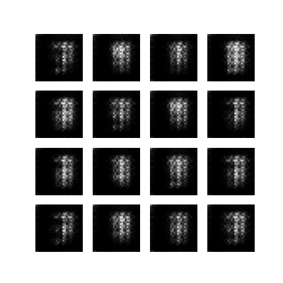
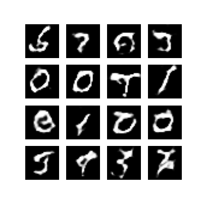
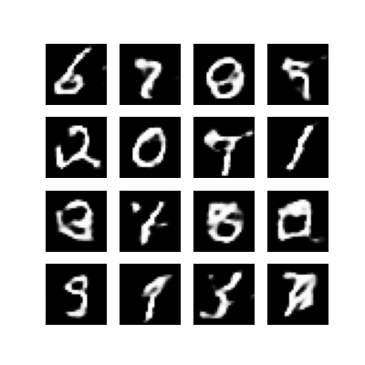
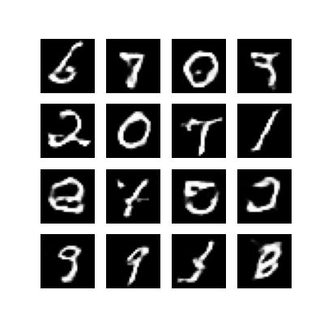
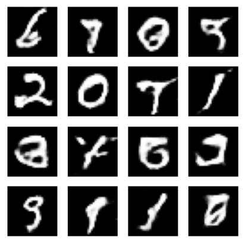

# Generative Adversarial Network for MNIST

*A Machine Learning II Project using Generative Adversarial Networks (GANs)*

---

## Overview

A Generative Adversarial Network (GAN) is a class of machine learning frameworks designed to generate new, synthetic data.

This project implements a Deep Convolutional GAN (DCGAN) trained on the MNIST dataset. It consists of two neural networks, a Generator and a Discriminator, that compete against each other. The Generator learns to create realistic handwritten digits from random noise, while the Discriminator learns to distinguish between real (from MNIST) and fake (from the Generator) images.

---

## Project Structure

```
MNIST-GAN/
│
├── images/
│   ├── i1.png
│   ├── i41.png
│   ├── i67.png
│   ├── i91.png
│   └── final.png
│
├── .gitattributes
├── .gitignore
├── mn.py
└── my_generator.h5
```

---

## Requirements

Install dependencies using:

```bash
pip install tensorflow numpy matplotlib
```

Typical dependencies:

```txt
tensorflow
numpy
matplotlib
```

---

## How It Works

1. **Load Data:** The MNIST dataset of handwritten digits is loaded and normalized.

2. **Build Generator:** A de-convolutional network that takes a random noise vector (latent dimension) and upsamples it into a 28x28x1 image.

3. **Build Discriminator:** A standard convolutional network that takes a 28x28x1 image and classifies it as "real" (output 1) or "fake" (output 0).

4. **Define Losses:**
     a. Discriminator Loss: Tries to correctly label real images as 1 and fake images as 0.
     b. Generator Loss: Tries to "fool" the discriminator into labeling its fake images as 1.

5. **Optimization:** The Generator and Discriminator are trained in an adversarial loop. In each step, the Discriminator is trained on a batch of real and fake images, then the Generator is trained to improve its ability to fool the Discriminator.

6. **Output:** The Generator model is saved (my_generator.h5) and sample images from different epochs are saved in the images/ directory.

---

## Displaying Images

### In **Python (Jupyter Notebook)**:

```python
import matplotlib.pyplot as plt
from PIL import Image

# Load and display image
img = Image.open("images/final.png")
plt.imshow(img, cmap='gray')
plt.axis("off")
plt.show()
```

---

## Running the Project

To train the model from scratch, run the main Python script:

```bash
python mn.py
```
This will start the training process and save the final model and checkpoint images.
---

## Example Results
The Generator's output improves significantly over training epochs.

**Epoch 1:**  


**Epoch 41:**  


**Epoch 67:**  


**Epoch 91:**  


**Final (100):**  


---

## References

* [Goodfellow et al., *Generative Adversarial Nets*, 2014](https://arxiv.org/abs/1406.2661)  
* [Radford et al., *Unsupervised Representation Learning with Deep Convolutional Generative Adversarial Networks*, 2015](https://arxiv.org/abs/1511.06434)  
* [TensorFlow DCGAN Tutorial](https://www.tensorflow.org/tutorials/generative/dcgan)

---

## Author

**Urvi Bhat**
